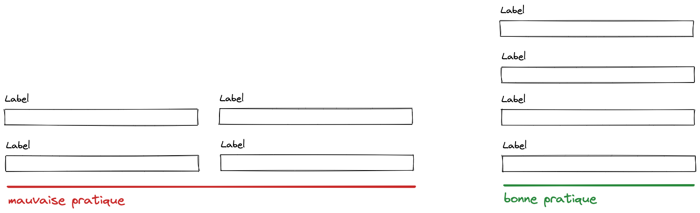
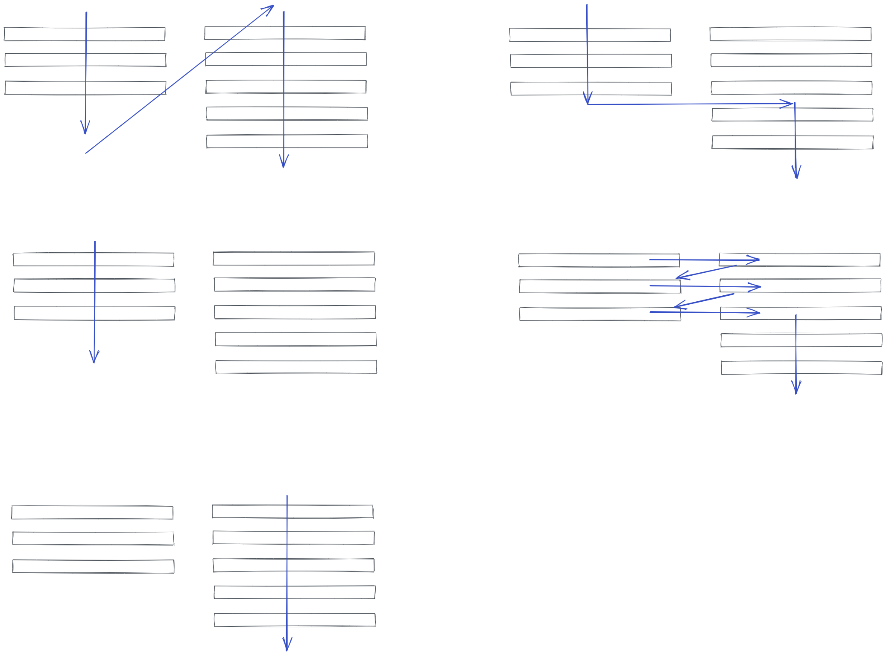

## Utiliser une seule colonne

Les formulaires sur une colonne sont plus facile à scanner

Les mises en page de formulaires à plusieurs colonnes sont sujettes à de mauvaises interprétations. Les utilisateurs sont plus susceptibles d'ignorer les champs obligatoires, de saisir des données dans les mauvais champs ou simplement d'abandonner complètement le formulaire. L'image ci-dessous illustre comment les utilisateurs ont tendance à mal interpréter les formulaires à plusieurs colonnes:

Lorsqu'un formulaire n'offre pas un chemin clair afin d'être complété, il faut beaucoup plus de temps pour le comprendre et le remplir. Avec un chemin de complétion linéaire (c'est-à-dire sur une colonne), il n'y a pas d'ambiguïté quant à la façon dont un formulaire doit être saisi.

### Références

- [Making forms more user-friendly - Keep it one column](https://uxdesign.cc/8-ways-to-make-forms-more-user-friendly-50f3f22c708c)
- [Form design best practices](https://medium.com/nextux/form-design-best-practices-9525c321d759)
- [Text fields & Forms design — UI components series - Avoid using multiple column layouts](https://uxdesign.cc/text-fields-forms-design-ui-components-series-2b32b2beebd0#b0e2)
- [Form Field Usability: Avoid Multi-Column Layouts (13% Make This Form Usability Mistake)](https://baymard.com/blog/avoid-multi-column-forms)
- [16 Tips that Will Improve Any Online Form - Use a single column design](https://uxplanet.org/the-18-must-do-principles-in-the-form-design-fe89d0127c92#7e55)
- [Designing Efficient Web Forms: On Structure, Inputs, Labels And Actions - One column vs. multiple columns](https://www.smashingmagazine.com/2017/06/designing-efficient-web-forms/#one-column-vs-multiple-columns)
